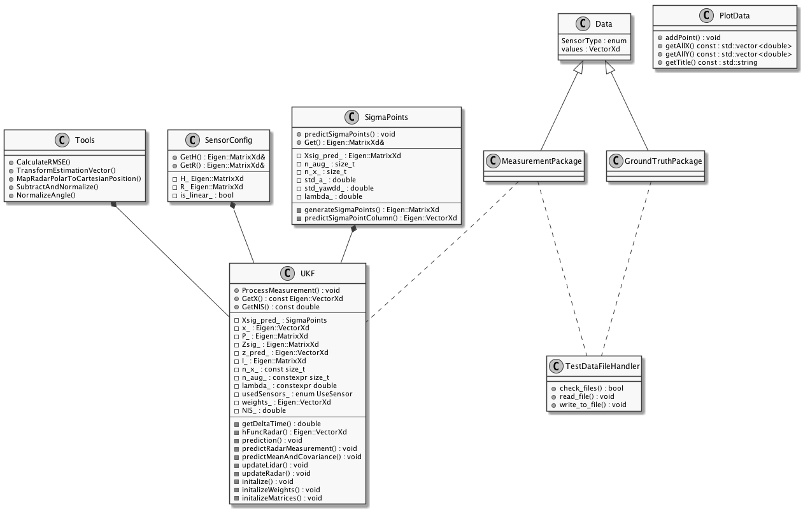

# Unscented Kalman Filter Project Starter Code
Self-Driving Car Engineer Nanodegree Program Project 2 - Term 2

---

## Dependencies

* cmake >= 3.5
* make >= 4.1
* gcc/g++ >= 5.4
* (optional) GNUplot >= 5.0.6

## Basic Build Instructions

1. Clone this repo.
2. Make a build directory: `mkdir build && cd build`
3. Compile: `cmake .. && make`
4. Run it: `./UnscentedKF path/to/input.txt path/to/output.txt`. You can find
   some sample inputs in 'data/'.
    - eg. `./UnscentedKF ../data/sample-laser-radar-measurement-data-1.txt output.txt`

## Overview

## Results
For std_a = 0.9 m/s^2 and std_yawdd = 0.6 rad/s^2

| Data 1    | Data 2   |
|-----------|----------|
| 0.0723371 | 0.19201  |
| 0.0795866 | 0.189339 |
| 0.589185  | 0.423164 |
| 0.574702  | 0.528618 |

